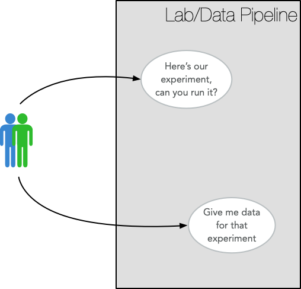

# Creating Experiment Requests: A Proposal

**Ben Keller**, _UW BIOFAB_, University of Washington

github: [bjkeller](https://github.com/bjkeller)

---

The concept of an experimental request was developed in the SD2 program as a way for a team of experimentalists to describe the experiments that they want performed.
The request would allow the labs performing the experiment to understand what samples they should expect, and what data was expected at the end of a run.
The request also contained information important to the group managing the data pipeline between the labs and the experimentalists, who needed the request to ensure that the data is there and reflects the described experiment.

We can consider the labs and the pipeline as a system that the experimentalists like in this use-case diagram



where the request represents the here's-our-experiment use-case.

Requests have been created as prose documents, which poses difficulties for automation.
In particular, a request contains knowledge that may not be captured in the plan carried out by a lab to satisfy the request, but is required downstream by both ETL processes in the pipeline and by the experimentalists when they perform analysis.
Because of these difficulties, a _structured_ experimental request was proposed to allow this knowledge to be captured in a representation that could be read by software tools in the lab and downstream.
A JSON representation has been developed that captures the design of an experiment, and the `cp_request` Python package in [this repository](https://github.com/SD2E/cp-request-api)) provides a way to read and write experimental requests as JSON.

Unfortunately, an experimental request for even a relatively simple experiment is a big, hairy combinatorial structure that can be tedious and error-prone to create.
And, experimentalists should have a more natural way to create a request than writing JSON or Python, and they should be able to define experiments in terms of requests that they have already created.

This document describes an approach in which an experimental request can be partially defined, and tools are provided allowing transformation of a request.

## An illustration

It is fairly common for experiments to develop incrementally, where an experiment may be run once, then extended and run again.
So, it might be reasonable for someone to want to make a request like

> _"Do yeast-states, but with a live/dead stain"_.

where "yeast-states" is a standard experiment, and the "live/dead stain" is under-specified.

The proposed idea is to implement functions that could be used in a Jupyter notebook to create and transform requests.
In this approach, the short request above might look like

```python
exp = define_experiment('Yeast States with Live/Dead Stain')
                  .like('Yeast States')
                  .with_stain('live_dead_stain')
```

which produces an experimental request with the live/dead stain unspecified by pulling the existing protocol named `'Yeast States'` from the pipeline.
Precisely, `exp` would be an `ExperimentalRequest` object with an unbound variable `live_dead_stain` since the stain has not yet been specified.
Functions would provide visualizations or text descriptions of the request.
For instance, a function, say `show_unbound(exp)`, would list the unbound variables, their type, and context.

The variables in a partial request like `exp` would need to be instantiated before being published.
For this the user would apply a substitution with something like

```python
yeast_states_stain = exp.apply(Substitution('live_dead_stain', stain_object))
```

where `stain_object` is a variable referencing a `NamedEntity` describing the stain.

To publish the request to the pipeline the user would use a command

```python
publish(yeast_states_stain)
```

## Keypoints

- It should be possible to use existing experiments to define a new experiment.
  The new experiment could extend the old one, or simply replace samples.
  In addition, it should be possible to create new versions of a request.

- Similarly, it should be possible to store existing partial requests as templates where details such as samples and media are unspecified.
  These would need to be distinct from published requests, which should not be partial.

- It should be possible to add/replace samples, and transform the experimental design.

- It should be possible to define subject-specific transformations (e.g., the `with_stain()` function in the example).

**[more to come...]**